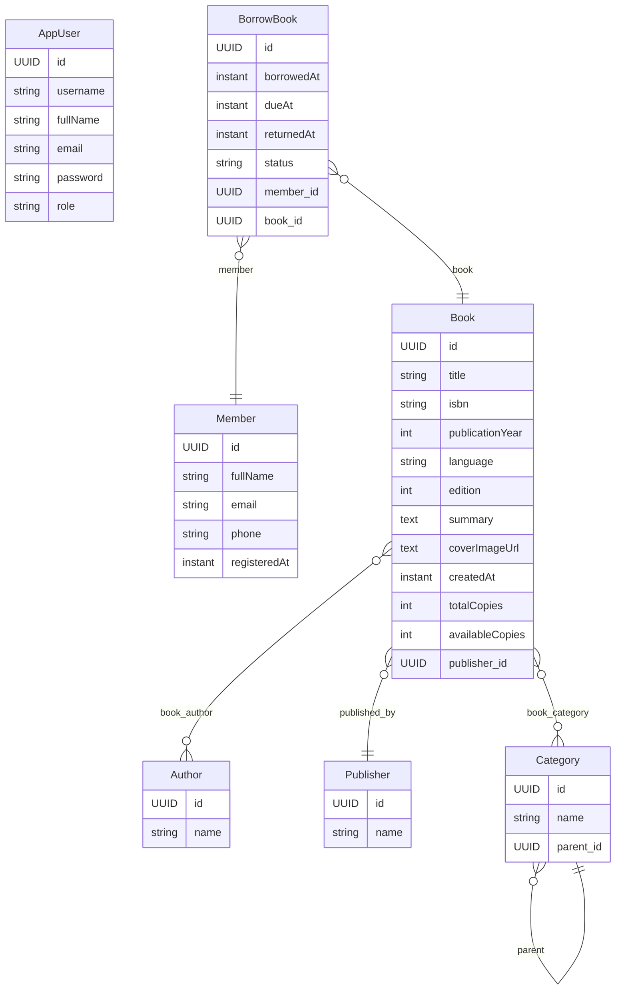

# LibraryFlow

Simple Library Management System built with Spring Boot, Spring Security (JWT), Spring Data JPA and PostgreSQL.

## Features

- Books with rich metadata (authors, publisher, categories, language, year, ISBN, edition, summary, cover)
- Members
- System users with roles: `ADMIN`, `LIBRARIAN`, `STAFF`
- Role-based access control with JWT
- Borrow & return with stock handling and overdue marking
- Global error handling (consistent JSON envelope)
- OpenAPI (Swagger UI)

## Tech Stack

- Java 17, Spring Boot 3.5.x
- Spring Web, Security, Data JPA, Validation, Actuator
- PostgreSQL
- `io.jsonwebtoken` (JJWT 0.12.x)
- springdoc-openapi

---

## How to Run

1) **Start PostgreSQL** (example using Docker):
```bash
docker run --name pg-lib -e POSTGRES_PASSWORD=postgres -e POSTGRES_DB=librarydb -p 5434:5432 -d postgres:16
```

2) **Configure application** (`src/main/resources/application.yml` example):
```yaml
server:
  port: 8080

spring:
  datasource:
    url: jdbc:postgresql://localhost:5434/librarydb
    username: YOUR_USERNAME
    password: YOUR_PASSWORD

```

3) **Build & Run**
```bash
mvn -U clean package
mvn spring-boot:run
```

---

## Security

- `POST /auth/login` with `{ "email": "...", "password": "..." }`
- Response includes JWT `token` and `role`
- For protected endpoints, send header: `Authorization: Bearer <token>`

### Roles Access (high level)
- `ADMIN`: full access (create/update/delete users, books, authors, categories, publishers, members; mark overdue)
- `LIBRARIAN`: manage books/authors/categories/publishers/members; borrow/return
- `STAFF`: read lists, perform borrow/return

---

## API Summary

All responses are wrapped with an envelope:
```json
{
  "status": 200,
  "message": "OK",
  "data": { ... },
  "path": "/api/...",
}
```

### Auth
- `POST /auth/login` → login and get JWT

### Users (ADMIN)
- `GET /api/users?page=&size=&sort=`
- `GET /api/users/{id}`
- `POST /api/users` (create)
- `PATCH /api/users/{id}` (update)
- `DELETE /api/users/{id}`

### Books
- `GET /api/books?page=&size=&sort=`
- `POST /api/books`
- `PUT /api/books/{id}`
- `DELETE /api/books/{id}`

### Authors
- `GET /api/authors?page=&size=&sort=`
- `POST /api/authors`
- `PUT /api/authors/{id}`
- `DELETE /api/authors/{id}`

### Categories
- `GET /api/categories?page=&size=&sort=`
- `GET /api/categories/tree`
- `POST /api/categories`
- `PUT /api/categories/{id}`
- `DELETE /api/categories/{id}` (fails if has children)

### Publishers
- `GET /api/publishers?page=&size=&sort=`
- `POST /api/publishers`
- `PUT /api/publishers/{id}`
- `DELETE /api/publishers/{id}`

### Members
- `GET /api/members?page=&size=&sort=`
- `POST /api/members`
- `PUT /api/members/{id}`
- `DELETE /api/members/{id}`

### Borrowing
- `POST /api/borrowing/borrow?memberId=&bookId=&dueAt=`
- `POST /api/borrowing/{txId}/return?returnedAt=`
- `POST /api/borrowing/{txId}/overdue` (ADMIN)

---

## Swagger

- Swagger UI: `http://localhost:8080/swagger-ui/index.html`
- OpenAPI JSON: `http://localhost:8080/v3/api-docs`

---

## ERD (Mermaid)



---

## SQL: Sample Data

> Run these after the app starts.

```sql
-- Authors
insert into author(id, name) values
  (gen_random_uuid(), 'Robert C. Martin'),
  (gen_random_uuid(), 'Martin Fowler'),
  (gen_random_uuid(), 'Joshua Bloch');

-- Publishers
insert into publisher(id, name) values
  (gen_random_uuid(), 'Prentice Hall'),
  (gen_random_uuid(), 'Addison-Wesley');

-- Categories (root + children)
insert into category(id, name, parent_id) values
  (gen_random_uuid(), 'Software', null);

-- get the id of 'Software' then use it as parent_id (example with CTE)
with sw as (
  select id from category where name='Software' limit 1
)
insert into category(id, name, parent_id)
select gen_random_uuid(), 'Clean Code', sw.id from sw;

-- Members
insert into member(id, full_name, email, phone, registered_at) values
  (gen_random_uuid(),'Alice Johnson','alice@example.com','+201111111111', now()),
  (gen_random_uuid(),'Bob Smith','bob@example.com','+201222222222', now());

-- Users (password: haneen123 ; bcrypt cost=10)
-- roles: ADMIN, LIBRARIAN, STAFF
insert into app_user(id, username, full_name, email, password, role) values
  (gen_random_uuid(),'admin','System Admin','admin@lib.local','$2a$10$8D5c7E9KQm3k1t6vQ6mVxe0HqU8bY0W4Lr9p8cJ7OQ8dZQF3xXvJm','ADMIN'),
  (gen_random_uuid(),'librarian','Main Librarian','librarian@lib.local','$2a$10$8D5c7E9KQm3k1t6vQ6mVxe0HqU8bY0W4Lr9p8cJ7OQ8dZQF3xXvJm','LIBRARIAN'),
  (gen_random_uuid(),'staff','Front Desk','staff@lib.local','$2a$10$8D5c7E9KQm3k1t6vQ6mVxe0HqU8bY0W4Lr9p8cJ7OQ8dZQF3xXvJm','STAFF');
```

---

## Example Book Payload

```json
{
  "title": "Clean Code",
  "isbn": "9780132350884",
  "edition": 1,
  "publicationYear": 2008,
  "language": "EN",
  "summary": "A Handbook of Agile Software Craftsmanship",
  "coverImageUrl": "https://example.com/clean-code.jpg",
  "publisher": { "id": "PUT_PUBLISHER_UUID" },
  "categories": [ { "id": "PUT_CATEGORY_UUID" } ],
  "authors": [ { "id": "PUT_AUTHOR_UUID" } ],
  "totalCopies": 3,
  "availableCopies": 3
}
```

---

## Notes

- Category delete is blocked if it still has children.
- Borrow stock is protected with `SELECT ... FOR UPDATE` to avoid race on `availableCopies`.
