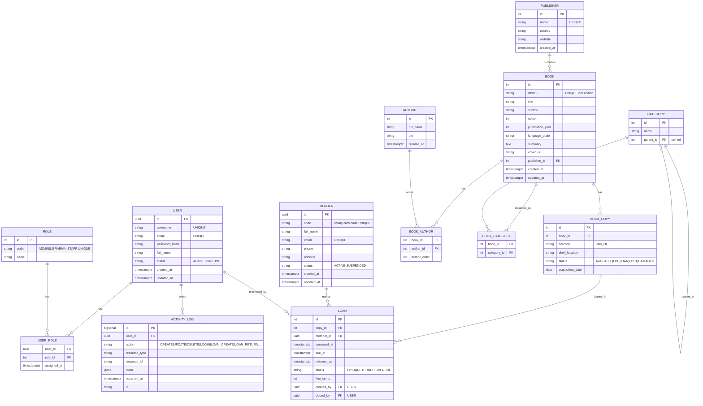

# LibraryFlow
A professional, production-ready backend for managing a library catalog and circulation (books, authors, categories, copies, members, loans) with role-based access control, auditing, and clean REST endpoints.

## LibraryFlow ERD

